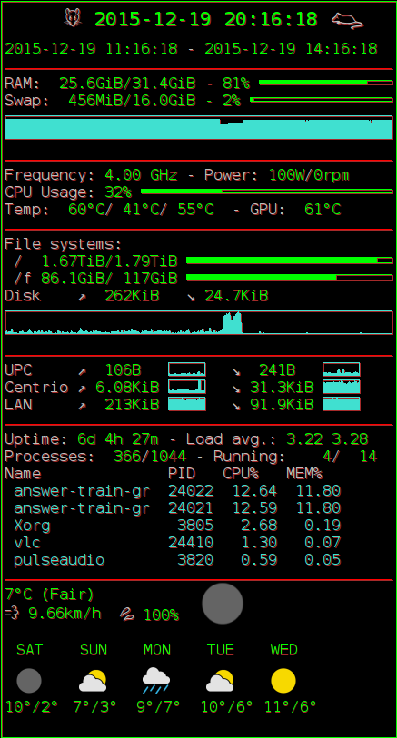

Pasky's Conky Setup
===================

This is a Conky configuration that shows rich information about the
computer hardware, system, as well as time and weather info.  You may
want to base your own setup on this.  Here's how it looks like:

The weather portion is an awful hack that I stole somewhere on the
internet (TODO find and credit the source).

TODO: Revamp the weather to better use space etc.

Fluxbox Setup
-------------

I have Conky on the secondary head of my dualhead setup, within the
Fluxbox slit.  The slit is configured to be permanently visible, but
sometimes, movies or other useful stuff occupies the secondary head.
So in my ~/.fluxbox/keys, I have

	# hide/show slit
	Mod4 bracketleft :MacroCmd {SetResourceValue session.screen0.slit.autoHide true} {Reconfigure}
	Mod4 bracketright :MacroCmd {SetResourceValue session.screen0.slit.autoHide false} {Reconfigure}
 
and I use ``win+[`` and ``win+]`` to show/hide the slit (therefore
Conky) quickly.:
